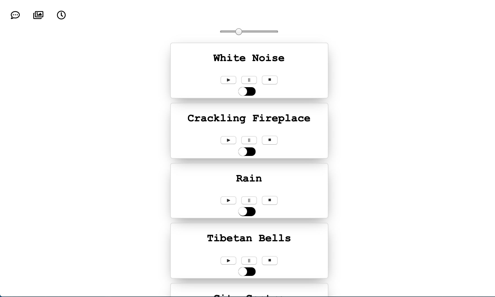
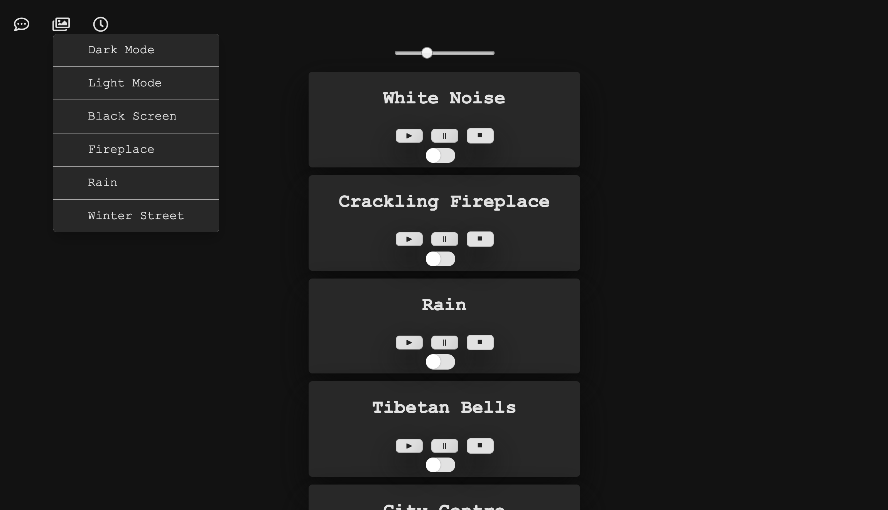

## Background and Overview
[
Aura](https://aura-js.herokuapp.com/) is a white noise app designed to aid in relaxation and focus during the day and better sleep at night. 

## Functionality & MVPs
- [x] Users will be able to access audio files
- [x] Playback Controls: play, pause, stop, toggle replay, volume slider
- [x] Sleep Timer: toggle replay on and off once time has reached zero
- [x] Background Changes: Smooth UI transitions between different backgrounds (Ex. dark mode, light mode, etc.)

# Technologies & Technical Challenges
Howler JS
SASS

## Architecture
Aura is build with pure HTML, Javascript and CSS/SCSS

## Project Timeline
### Feb 3
- Project Setup (lite-server, webpack, Hower JS)
- Audio files imported and functional
- Playback Controls: play, stop, pause, volume up, volume down

### Feb 4
- Playback Controls: toggle loop/replay
- Sleep Timer ( working but not linked to audio yet)
- Background: dropdown functional

### Feb 5
- Background: options & styling (SASS CSS)
- Restructure (broken up into JS classes)
- Fixed Bugs: limit playback of one audio file at a time

### Feb 6
- Sleep Timer: fully functional and linked to audio playback
- CSS styling for app

### Feb 7
- Playback Controls: individual audio volume buttons changed to one volume slider for the entire app
- Heroku deployment

### Feb 8 and 9
- Fixed Bugs: Sleep Timer resets upon completion (hitting play will not restart the timer the second time)
- About Dropdown: About & Descrition modals


## Audio Display
Upon clicking on a video, the user will be directed to that video's display page. There, the video will be displayed on an enlarged scale and is able to be played on-click. The video is able to be liked and commented upon, and the user can also like and dislike comments. Additionally, other videos are shown on the side, and clicking on one of those videos will take the user to that video's display page.



Upon rendering a video's display page, the likes specifically tied to that video and the comments of that video will be fetched. This prevents each display page from having to receive data from all of the likes on the database. Below is shown the Express route for fetching likes.
```
router.get('/likes/videos/:video_id', (req, res) => {
    Like.find({likeableType: 'video', likeableId: req.params.video_id})
        .then(likes => res.json(likes))
        .catch(error => res.status(404).json({ noLikes: 'No likes found with that video id' }))
});
```
Since both videos and comments can be liked, the GET route needs to accept both the type of entity being liked (video or comment) as well as that entity's ID. Similarly, comments will be fetched only for the video associated with the current video display page.

Users can only like and comment on a video if logged in; otherwise, error messages will be rendered instructing the user to log in. Additionally, the user cannot like or dislike the same video or comment more than once. Pressing like will cause the thumbs-up icon to turn blue while pressing dislike will cause the thumbs-down icon to turn red (as seen in the image above). Pressing either a second time will delete that like or dislike, and the icon will turn gray again.

## Background Changes
Users also have the ability to change between different backgrounds. Selecting a background will load the styling for the entire page specific to the background selected. This is accomplished via Document, JavaScript DOM EventListeners and Sass's nested CSS selectors 




One event listener is listening for a click on the background dropdown button another for whichever option is selected. Class names are added/removed based on whichever option the user selects:
```
backgroundDropDown() {
    backgroundButton[0].addEventListener("click", () => {
      document.getElementById("background-dd").classList.toggle("show");
    })

    for (let i = 0; i < backgroundOptions.length; i++) {
      let option = backgroundOptions.item(i);

      option.addEventListener("click", () => {
        let body = document.querySelector("body");
        let text = option.textContent;

        if (text === "Dark Mode") {
          body.className = ""
          body.classList.add("dark")
        } else if (text === "Light Mode") {
          body.className = ""
          body.classList.add("white")
        }
        .
        .
        .
        document.getElementById("background-dd").classList.toggle("show")
    })
  }
}
```
Updating the classList utilizes the nested CSS selectors created using Sass and the user is able to experience smooth transitions between different backgrounds without interfering with audio playback or the sleep timer if they have one set.


## Future directions
- Alarm Clock feature
- Utilize local storage for CRUD of uploads